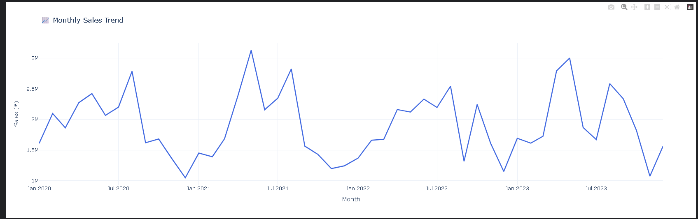
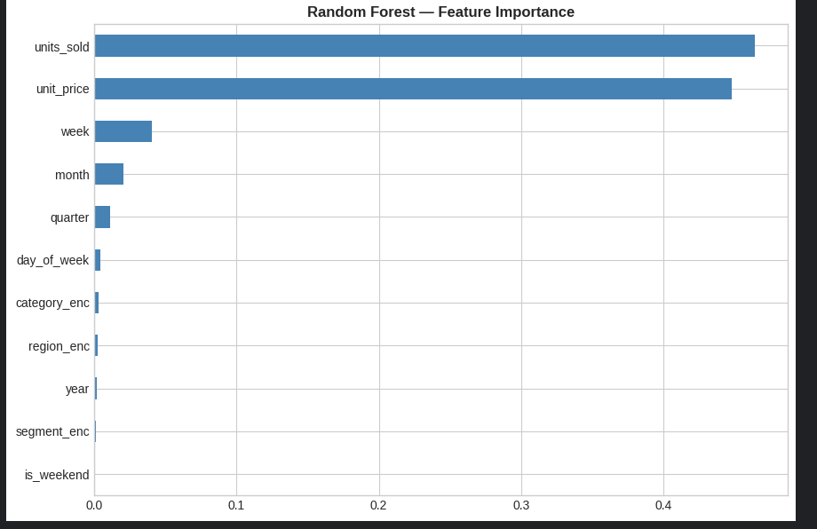
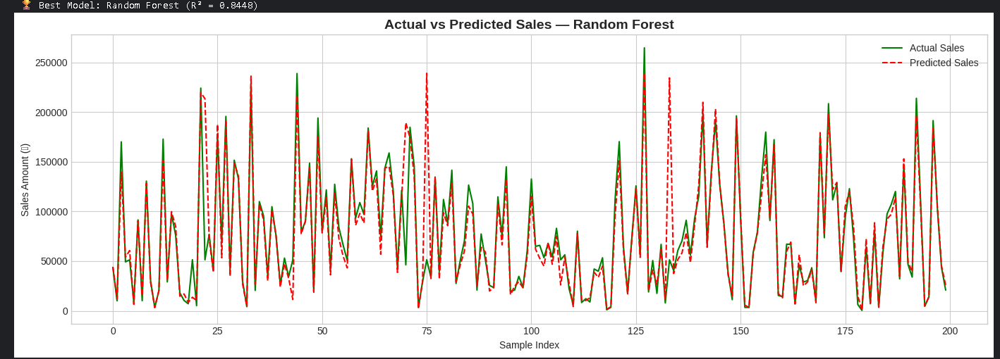
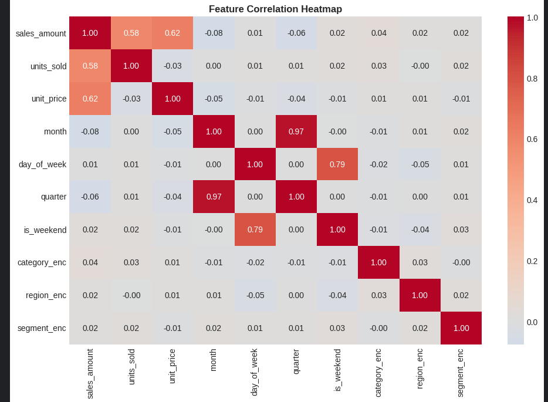

# Sales Forecasting System — Data Science Internship Project

Predicting future sales using historical data using Machine Learning and Time Series Analysis.

---

## Project Overview

This project builds an end-to-end Sales Forecasting System that:

- Cleans and preprocesses raw historical sales data  
- Performs Exploratory Data Analysis (EDA)  
- Trains and compares multiple ML models (Linear Regression, Random Forest, Gradient Boosting)  
- Applies ARIMA for time-series forecasting  
- Visualizes predictions against actual values using Matplotlib and Plotly  

---
## Deliverables

- Cleaned dataset and preprocessing scripts
- EDA notebook with insights
- Trained ML models (Linear Regression, Random Forest, Gradient Boosting)
- ARIMA time-series forecast
- Prediction visualizations
- GitHub repository with full documentation

  ## Key Visualizations

### Monthly Sales Trend

  

### Model Performance Comparison

  

### Feature Importance (Random Forest)

  

### Actual vs Predicted (Random Forest)

  

### Correlation Heatmap

  

